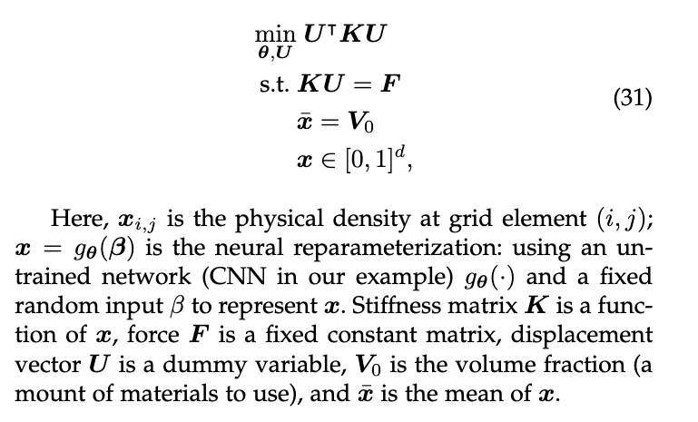

# Installation

conda create -n ncvx_exp_pami python=3.9

## Install pygranso

    git clone https://github.com/sun-umn/PyGRANSO.git

    cd PyGRANSO

    pip install git+https://github.com/sun-umn/PyGRANSO@dimension_factor

    pip install -r requirements.txt -f https://download.pytorch.org/whl/cu111/torch_stable.html

## (Optional, not used in this src) Install neural-structral-optimization

pip install -q tf-nightly git+https://github.com/google-research/neural-structural-optimization.git

# Problem Description

The PyGRANSO implementation is based on the MBB beam example of *neural-structral-optimization*. See section **MBB Beam (Figure 2 from paper)** of https://github.com/google-research/neural-structural-optimization/blob/master/notebooks/optimization-examples.ipynb for more details.

# TODO List

1. Stiffness matrix *K* should be a function of grid density *x*. Current implementation uses a fixed constant matrix *K*. Please check the function *objective* in the file *topo_physics.py* in the *neural-structral-optimization* package for more details

2. Current implementation of PyTorch CNN is not a faithful translation of the original TensorFlow version CNN in MBB Beam examle. For example, weight intilizer for the convolution kernel, AddOffSet, latent initializers are not implemented. Please check the file *models.py* in the *neural-structral-optimization* package for more details.

3. Einstein Summation used in the equality constraints *KU = F*. Current implementation of physical law is not the same.

